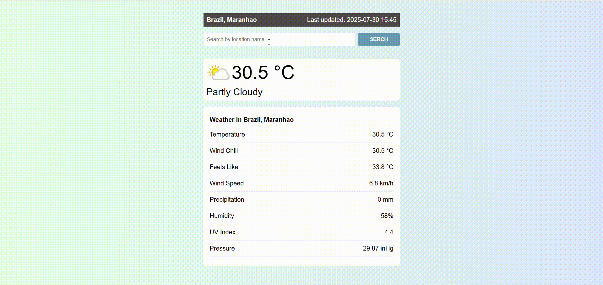

# 🌦️ Angular Weather App

<p align="center">

</p>

This is a weather app built with **Angular**, which consumes data from the **WeatherAPI** to display up-to-date weather information with a modern, responsive interface.

You can access the live demo [here](https://jordan-will.github.io/angular-weather-app/)

---

## 🛠️ Technologies used

- ⚡ **Angular 20+**
- 🌐 **HttpClient**
- 🧪 **Automated tests with Jasmine and Karma**
- 🎨 **SCSS with BEM methodology**
- ☁️ **WeatherAPI** (https://www.weatherapi.com/)

---

## 🚀 How to run the project

### 🔧 Install dependencies

```bash
npm install
```
### ▶️ Run the project locally
```bash
ng serve
```
Access in the browser: http://localhost:4200

### ✅ Run the tests
```bash
npm run test
```
###📬 Contact
📧 jordan.willian.mp@gmail.com